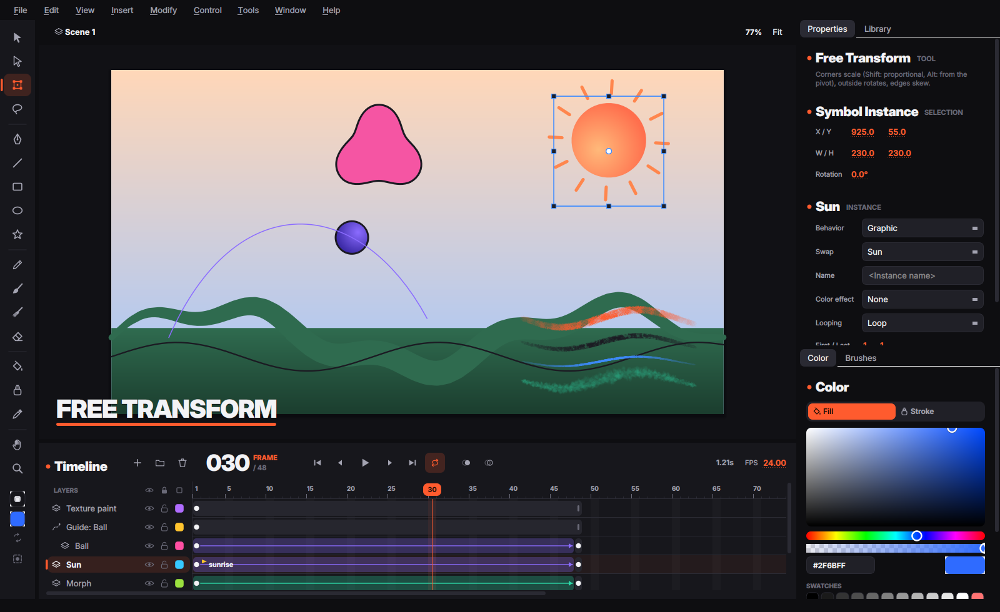
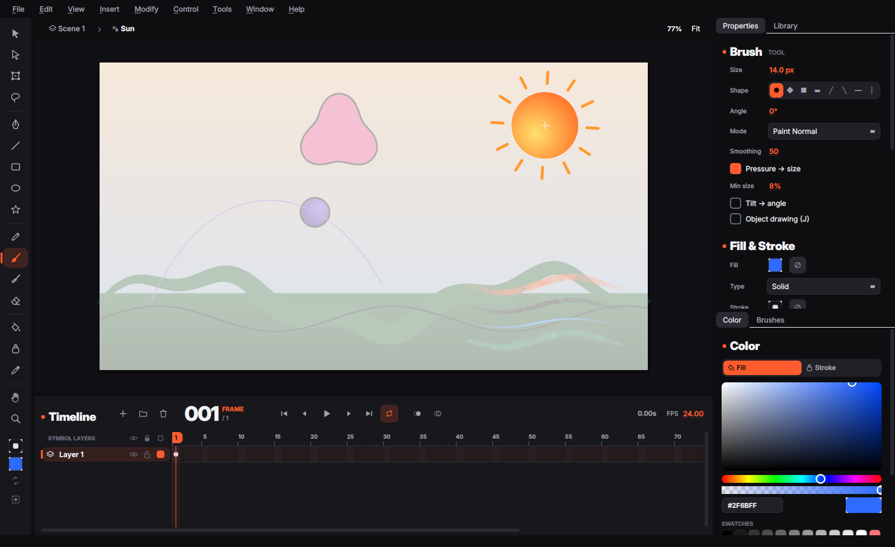
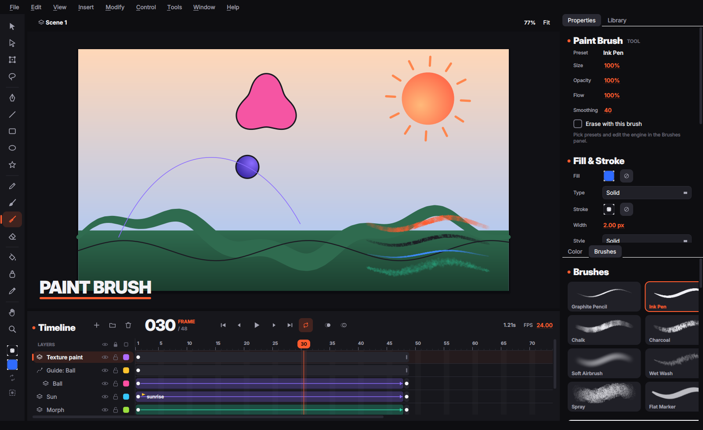
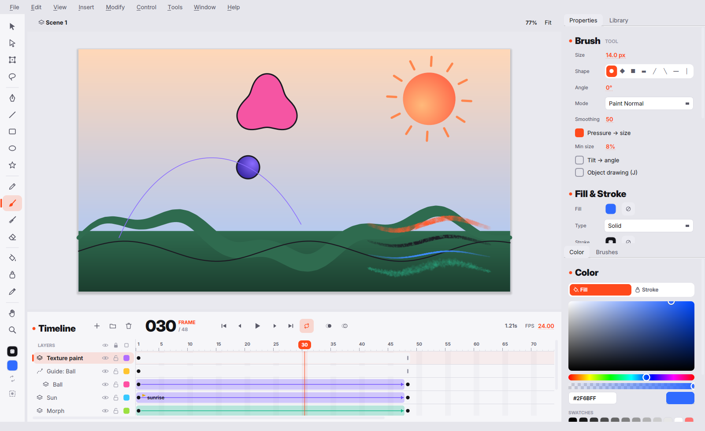

<div align="center">

# Vertexa

**An open-source 2D vector animation studio — a free alternative to Adobe Animate.**
Written in C++20 with Qt 6.

[Русская версия](README.ru.md) · [Architecture](docs/ARCHITECTURE.md) · [Shortcuts](docs/HOTKEYS.md) · [References](docs/REFERENCES.md) · [Roadmap](docs/ROADMAP.md)


</div>

> **Status: first iteration (0.1).** The foundations are in place and covered by
> tests: exact vector kernel, Flash-style shapes, timeline, symbols, tweens,
> blend modes, tablets and texture brushes. Expect rough edges.

## Highlights

**Exact vectors.** Every curve is a double-precision cubic Bezier; nothing is
ever flattened in the document. All shape editing runs through a planar
arrangement that splits curves at their true intersections and labels faces
*topologically* (no sampling), so merging, erasing and filling are exact.

**Drawing like Animate.**
- **Brush (B)** — the fill-based Animate brush: the stroke *is* the swept area of
  the tip (exact tangent envelope + circular joins, refitted within 0.08 px).
  Pressure → size, tilt → angle, smoothing, 8 tip shapes and the five brush
  modes: *Paint Normal, Fills, Behind, Selection, Inside*.
- **Merge drawing** — same-colour fills fuse, lines split fills, painting over
  a shape replaces what's underneath. **Object drawing (J)** keeps shapes apart.
- **Eraser (E)** — *Erase Normal, Fills, Lines, Selected Fills, Inside* and the
  **faucet**.
- **Paint Bucket (K)** with *Don't close / small / medium / large gaps*, **Ink
  Bottle (S)**, **Eyedropper (I)**.
- **Shapes** — Line, Rectangle (corner radius), Oval, PolyStar, Pen, Pencil
  (Straighten / Smooth / Ink).
- **Selection (V)** — click fills and line segments, double-click for connected
  parts, drag an unselected edge to *bend* it, drag a corner to move it, marquee
  and **Lasso (L)** cut shapes. **Subselection (A)** edits points and Bezier
  handles, **Free Transform (Q)** scales/rotates/skews around a movable pivot.
- **Seam-free rendering** — all fills of a shape are rasterised in one
  exact-coverage pass, so adjacent colours never show hairline gaps.

**Timeline.** Layers, folders, mask and motion-guide layers, visibility / lock /
outline toggles, keyframes, blank keyframes, spans, labels, onion skin, drag to
move frames and layers, and the familiar keys: `F5`, `Shift+F5`, `F6`,
`Shift+F6`, `F7`, `Enter`, `,` `.`, `Ctrl+Alt+C/X/V`… ([all shortcuts](docs/HOTKEYS.md)).

**Symbols.** Movie clips and graphics in a library (button symbols can be
created; their Up/Over/Down/Hit states are next on the roadmap), `F8` Convert to
Symbol with a registration grid, edit in place (double-click, breadcrumbs),
Break Apart (`Ctrl+B`), groups, swap symbol, instance names, colour effects
(Brightness, Tint, Alpha, Advanced), graphic looping (Loop, Play Once, Single
Frame, reverse modes, first/last frame).

**Animation.**
- **Classic tweens** with Animate's matrix decomposition, rotation (Auto, CW,
  CCW × n), the classic ease plus 27 preset eases and custom curves, **motion
  guides** with *orient to path*.
- **Shape tweens** that morph fills, holes, strokes and gradients, with
  *Distributive / Angular* blending and **shape hints** (`Ctrl+Shift+H`).

**Blend modes.** All 14 Animate blend modes on movie clips (Normal, Layer,
Darken, Multiply, Lighten, Screen, Overlay, Hard Light, Add, Subtract,
Difference, Invert, Alpha, Erase) plus 13 more from Krita, also usable per
layer with opacity.

**Tablets.** Pressure, tilt, barrel rotation and the eraser tip through Qt's
tablet API (Wacom, Huion, XP-Pen, Windows Ink / WinTab, macOS, X11/Wayland);
uncompressed events, an editable pressure curve and a live test pad.

**Texture brushes like Krita.** The **Paint Brush (Y)** uses a dab engine with
auto or image tips (import GIMP/Krita `.gbr` and `.png`), spacing, flow/opacity
"wash" build-up, sensor curves for size/opacity/flow, tilt and direction
rotation, jitter, scatter and a canvas-anchored texture (multiply / subtract /
height). Strokes stay resolution-independent data and re-render at any zoom.

**Files.** Lossless `.vtx` (JSON) documents, PNG sequence, SVG frame and
video export (through FFmpeg when installed).

<p align="center">
   
   
</p>

## Building

Requirements: a C++20 compiler (GCC 11+, Clang 14+, MSVC 2022), CMake 3.21+,
Qt 6.4+ (Core, Gui, Widgets).

```bash
# Ubuntu / Debian
sudo apt install build-essential cmake ninja-build qt6-base-dev
# macOS
brew install cmake ninja qt
# Windows: install Qt 6 with the online installer, then use a VS 2022 prompt

cmake -S . -B build -G Ninja -DCMAKE_BUILD_TYPE=Release
cmake --build build
ctest --test-dir build --output-on-failure
./build/src/app/vertexa --demo      # macOS: open build/src/app/vertexa.app
```

On macOS pass `-DCMAKE_PREFIX_PATH="$(brew --prefix qt)"` to the first `cmake`
call; on Windows point `CMAKE_PREFIX_PATH` at the Qt kit (e.g. `C:\Qt\6.8.0\msvc2022_64`).

Useful options: `vertexa file.vtx` opens a document, `--demo` opens the demo
scene, `--screenshot out.png [--frame N] [--state instance|edit|brushes|light]`
renders the UI to an image (handy for CI and docs).

## Project layout

```
src/geom    exact geometry kernel (pure C++, no Qt): Bezier math, intersections,
            planar arrangement, booleans, curve fitting, brush outlines, stabiliser
src/core    document model: Flash-style shape graph and its operations, elements,
            timelines, symbols, tweens, easing, texture brush presets, .vtx format
src/render  scanline rasteriser, blend modes, dab engine, renderer, SVG export
src/app     Qt Widgets application: stage, tools, timeline and panels
tests       unit tests for every layer plus UI tests driving the real stage
```

See [docs/ARCHITECTURE.md](docs/ARCHITECTURE.md) for how the pieces fit together.

## Credits

Vertexa is inspired by Adobe Animate / Flash and learns from
[Krita](https://invent.kde.org/graphics/krita),
[OpenToonz](https://github.com/opentoonz/opentoonz) and
[Flare](https://github.com/Flare-Animate/Flare). No code was copied from these
projects; see [docs/REFERENCES.md](docs/REFERENCES.md) for what was taken from where.
The UI uses the [Inter](https://rsms.me/inter/) typeface (SIL OFL 1.1).

## License

GNU General Public License v3.0 or later — see [LICENSE](LICENSE).
