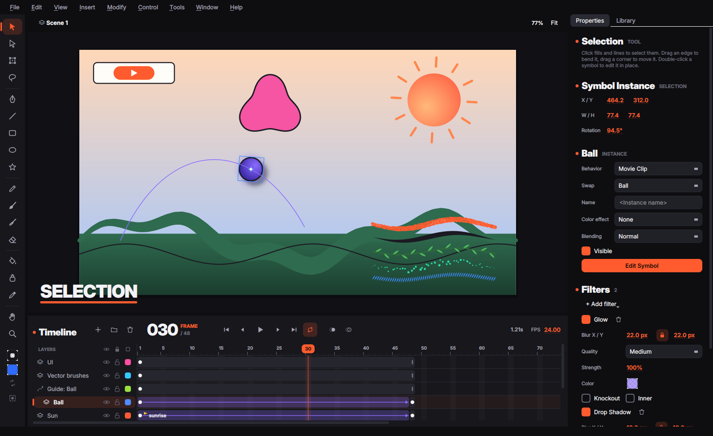
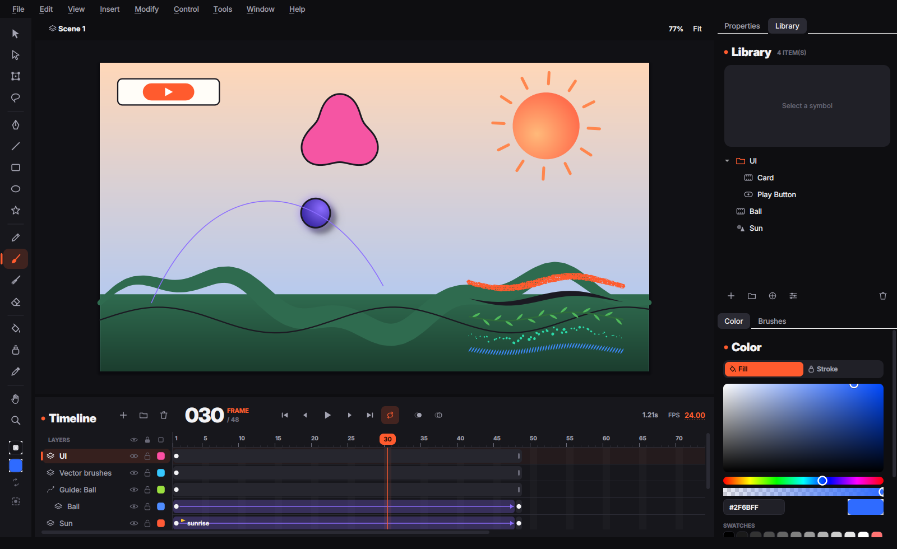

<div align="center">

# Vertexa

**An open-source 2D vector animation studio — a free alternative to Adobe Animate.**
Written in C++20 with Qt 6.

[Русская версия](README.ru.md) · [Architecture](docs/ARCHITECTURE.md) · [Shortcuts](docs/HOTKEYS.md) · [References](docs/REFERENCES.md) · [Roadmap](docs/ROADMAP.md)


</div>

> **Status: first iteration (0.1).** The foundations are in place and covered by
> tests: exact vector kernel, Flash-style shapes, timeline, symbols, tweens,
> blend modes, filters, tablets, vector brushes and FLA import. Expect rough
> edges.

## Highlights

**Exact vectors.** Every curve is a double-precision cubic Bezier; nothing is
ever flattened in the document. All shape editing runs through a planar
arrangement that splits curves at their true intersections and labels faces
*topologically* (no sampling), so merging, erasing and filling are exact.

**Drawing like Animate.**
- **Brush (B)** — the fill-based Animate brush: the stroke *is* the swept area of
  the tip (exact tangent envelope + circular joins, refitted within 0.08 px).
  Pressure → size, tilt → angle, smoothing, 8 tip shapes and the five brush
  modes: *Paint Normal, Fills, Behind, Selection, Inside*.
- **Merge drawing** — same-colour fills fuse, lines split fills, painting over
  a shape replaces what's underneath. **Object drawing (J)** keeps shapes apart.
- **Eraser (E)** — *Erase Normal, Fills, Lines, Selected Fills, Inside* and the
  **faucet**.
- **Paint Bucket (K)** with *Don't close / small / medium / large gaps*, **Ink
  Bottle (S)**, **Eyedropper (I)**.
- **Shapes** — Line, Rectangle (corner radius), Oval, PolyStar, Pen, Pencil
  (Straighten / Smooth / Ink).
- **Selection (V)** — click fills and line segments, double-click for connected
  parts, drag an unselected edge to *bend* it, drag a corner to move it, marquee
  and **Lasso (L)** cut shapes. **Subselection (A)** edits points and Bezier
  handles, **Free Transform (Q)** scales/rotates/skews around a movable pivot.
- **Seam-free rendering** — all fills of a shape are rasterised in one
  exact-coverage pass, so adjacent colours never show hairline gaps.

**Timeline.** Layers, folders, mask and motion-guide layers, visibility / lock /
outline toggles, keyframes, blank keyframes, spans, labels, onion skin, drag to
move frames and layers, and the familiar keys: `F5`, `Shift+F5`, `F6`,
`Shift+F6`, `F7`, `Enter`, `,` `.`, `Ctrl+Alt+C/X/V`… ([all shortcuts](docs/HOTKEYS.md)).

**Symbols.**
- Movie clips, graphics and buttons in a library with **folders** (drag
  symbols between folders, rename, nest, delete while keeping the contents).
- `F8` Convert to Symbol with a registration grid, folder and 9-slice
  option; edit in place (double-click, breadcrumbs); Break Apart (`Ctrl+B`);
  groups; swap symbol; instance names and visibility.
- Colour effects (Brightness, Tint, Alpha, Advanced) and graphic looping (Loop,
  Play Once, Single Frame, reverse modes, first/last frame).
- As in Animate, each instance has its own behaviour, so a movie clip can be
  placed as a graphic and the other way round.
- **Buttons** have Up / Over / Down / Hit frames (labelled in the timeline).
  **Enable Simple Buttons** (`Ctrl+Alt+B`) makes them react to the pointer on
  the stage, with the Hit frame as the clickable area.
- **9-slice scaling**: drag the four guides while editing the symbol; scaled
  instances keep their corners, and curves are split exactly at the guides.
- On the in-between frames of a classic tween the selection sits on the
  tweened instance. Moving or editing it there inserts a keyframe with the
  tweened state first.

**Animation.**
- **Classic tweens** with Animate's matrix decomposition, rotation (Auto, CW,
  CCW × n), the classic ease plus 27 preset eases and custom curves, **motion
  guides** with *orient to path*.
- **Shape tweens** that morph fills, holes, strokes and gradients, with
  *Distributive / Angular* blending and **shape hints** (`Ctrl+Shift+H`).

**Blend modes.** All 14 Animate blend modes on movie clips (Normal, Layer,
Darken, Multiply, Lighten, Screen, Overlay, Hard Light, Add, Subtract,
Difference, Invert, Alpha, Erase) plus 13 more from Krita, also usable per
layer with opacity.

**Filters.** Animate's filter stack on movie clips and buttons: Drop Shadow,
Blur, Glow, Bevel, Gradient Glow, Gradient Bevel and Adjust Color, with blur X/Y
(linked or not), strength, quality (Low / Medium / High box-blur passes), angle,
distance, knockout, inner and hide object. Filters animate in classic tweens and
export to SVG.

**Tablets.** Pressure, tilt, barrel rotation and the eraser tip through Qt's
tablet API (Wacom, Huion, XP-Pen, Windows Ink / WinTab, macOS, X11/Wayland);
uncompressed events, an editable pressure curve and a live test pad.

**Vector brushes.** The **Paint Brush (Y)** paints texture without ever
leaving vectors: every stroke becomes ordinary fills that can be selected,
erased, recoloured and shape-tweened.
- **Art brushes** stretch a vector artwork along the stroke (ink taper, dry
  brush), **pattern brushes** repeat a tile bent to the path (rope, dashes,
  vine), as Animate's Art and Pattern brushes.
- **Textured brushes** (chalk, charcoal, pencil) give the swept area a rough
  edge and punch grain holes from a noise field anchored to the canvas, so
  overlapping strokes line up.
- **Scatter brushes** (spray, stipple) spray vector dabs along the path.
- Pressure → size curves, smoothing, the five paint modes, object drawing and
  an *erase with this brush* option. **Art Brush / Pattern Brush from
  Selection** turns any artwork (lines included) into a brush saved in the
  document; user presets are kept across documents.

**Files.** Lossless `.vtx` (JSON) documents, PNG sequence, SVG frame and
video export (through FFmpeg when installed).

**FLA import (`Ctrl+R`).** Opens Adobe Flash / Animate documents:
- binary `.fla` from Flash 5 to CS4, read straight from the OLE2 container and
  the MFC object streams ([what is decoded and how](docs/FLA_FORMAT.md));
- XFL — the zipped `.fla` of CS5 and later, a `.xfl` folder or `DOMDocument.xml`.

Scenes, layers (folders, guides, masks), keyframes, labels, classic tweens with
eases, shapes with solid and gradient fills and strokes, symbols with their
libraries, instance behaviour, loops, colour effects, filters and blend modes
come across. A report lists anything that could not be imported exactly
(bitmaps, text, sounds and binary shape tweens for now).

<p align="center">
   
   
   
</p>

## Building

Requirements: a C++20 compiler (GCC 11+, Clang 14+, MSVC 2022), CMake 3.21+,
Qt 6.4+ (Core, Gui, Widgets).

```bash
# Ubuntu / Debian
sudo apt install build-essential cmake ninja-build qt6-base-dev
# macOS
brew install cmake ninja qt
# Windows: install Qt 6 with the online installer, then use a VS 2022 prompt

cmake -S . -B build -G Ninja -DCMAKE_BUILD_TYPE=Release
cmake --build build
ctest --test-dir build --output-on-failure
./build/src/app/vertexa --demo      # macOS: open build/src/app/vertexa.app
```

On macOS pass `-DCMAKE_PREFIX_PATH="$(brew --prefix qt)"` to the first `cmake`
call; on Windows point `CMAKE_PREFIX_PATH` at the Qt kit (e.g. `C:\Qt\6.8.0\msvc2022_64`).

Useful options: `vertexa file.vtx` opens a document, `--demo` opens the demo
scene, `--screenshot out.png [--frame N] [--state instance|edit|brushes|light|library|filters]`
renders the UI to an image (handy for CI and docs).

## Project layout

```
src/geom    exact geometry kernel (pure C++, no Qt): Bezier math, intersections,
            planar arrangement, booleans, curve fitting, brush outlines, stabiliser
src/core    document model: Flash-style shape graph and its operations, elements,
            timelines, symbols, tweens, easing, filters, vector brushes, .vtx format
src/core/io FLA (OLE2 + MFC archives) and XFL (ZIP + XML) import
src/render  scanline rasteriser, blend modes, filters, renderer, SVG export
src/app     Qt Widgets application: stage, tools, timeline and panels
tests       unit tests for every layer plus UI tests driving the real stage
```

See [docs/ARCHITECTURE.md](docs/ARCHITECTURE.md) for how the pieces fit together.

## Credits

Vertexa is inspired by Adobe Animate / Flash and learns from
[Krita](https://invent.kde.org/graphics/krita),
[OpenToonz](https://github.com/opentoonz/opentoonz) and
[Flare](https://github.com/Flare-Animate/Flare). No code was copied from these
projects; see [docs/REFERENCES.md](docs/REFERENCES.md) for what was taken from where.
The UI uses the [Inter](https://rsms.me/inter/) typeface (SIL OFL 1.1).

## License

GNU General Public License v3.0 or later — see [LICENSE](LICENSE).
