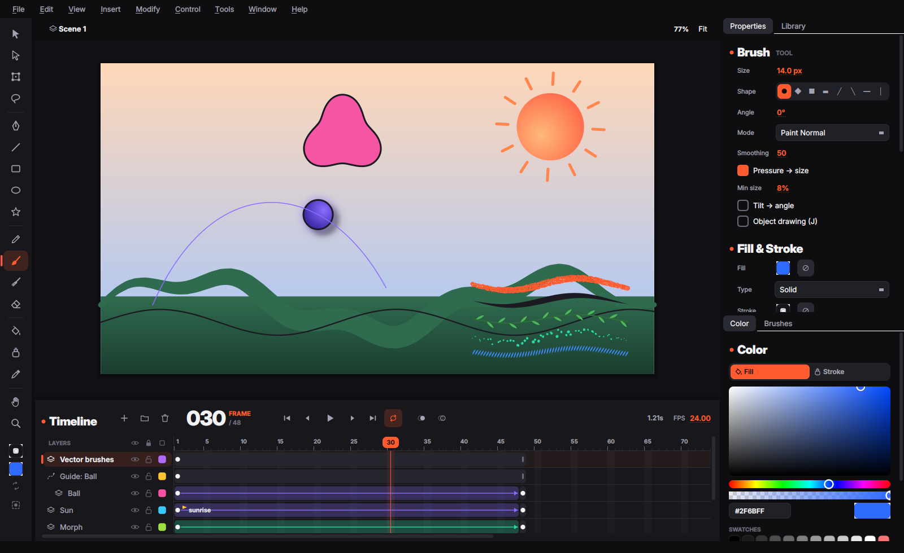

<div align="center">

# Vertexa

**Open-source студия 2D векторной анимации — свободная альтернатива Adobe Animate.**
C++20 и Qt 6.

[English](README.md) · [Архитектура](docs/ARCHITECTURE.md) · [Горячие клавиши](docs/HOTKEYS.md) · [Референсы](docs/REFERENCES.md) · [Дорожная карта](docs/ROADMAP.md)



</div>

> **Статус: первая итерация (0.1).** Фундамент готов и покрыт тестами: точное
> векторное ядро, фигуры в стиле Flash, таймлайн, символы, твины, режимы
> наложения, фильтры, планшеты, векторные кисти и импорт FLA.

## Что уже умеет

**Точные векторы.** Любая кривая — кубический Безье в двойной точности, в
документе ничего не «растрируется» и не аппроксимируется ломаными. Все операции
над фигурами идут через планарное разбиение: кривые режутся в точках настоящих
пересечений, а грани размечаются *топологически* (без сэмплирования), поэтому
слияние, стирание и заливка точные.

**Рисование как в Animate.**
- **Кисть (B)** — заливочная кисть Animate: штрих — это ровно та область,
  которую замела кисть (точная огибающая + круговые стыки, переаппроксимация с
  допуском 0,08 px). Давление → размер, наклон → угол, сглаживание, 8 форм
  кончика и пять режимов: *Paint Normal, Fills, Behind, Selection, Inside*.
- **Merge drawing** — одинаковые цвета сливаются, линии режут заливку, новый
  рисунок заменяет то, что под ним. **Object drawing (J)** держит фигуры раздельно.
- **Ластик (E)** — *Erase Normal, Fills, Lines, Selected Fills, Inside* и «кран».
- **Заливка (K)** с закрытием щелей (нет / малые / средние / большие),
  **Чернильница (S)**, **Пипетка (I)**.
- **Фигуры** — линия, прямоугольник со скруглением, овал, многоугольник/звезда,
  перо, карандаш (Выпрямление / Сглаживание / Чернила).
- **Выделение (V)** — клик по заливке и сегменту линии, двойной клик выделяет
  связанное, перетаскивание невыделенного ребра *изгибает* его, угла — двигает,
  рамка и **Лассо (L)** разрезают фигуры. **Частичное выделение (A)** правит
  точки и ручки Безье, **Свободное преобразование (Q)** — масштаб, поворот,
  наклон вокруг подвижной точки трансформации: клик берёт рисунок под
  курсором (а не весь слой), протягивание по пустому месту выделяет рамкой,
  точку трансформации можно перетащить и для рисунков, и для нескольких
  объектов (она прилипает к центру и маркерам, двойной клик возвращает её).
  Поворот идёт вокруг неё; если её сдвинуть с центра, от неё же идут
  масштабирование и наклон (`Alt` — от противоположной стороны).
  Вокруг нескольких выделенных объектов рисуется общая рамка.
- **Правый клик по сцене** выделяет то, что под курсором, и открывает меню:
  вырезать / копировать / вставить, *Convert to Symbol*, *Break Apart*,
  группировка, порядок и трансформации.
- **Рендер без швов** — все заливки фигуры растеризуются за один проход с точным
  покрытием, поэтому между соседними цветами нет просветов.
- **Рендер на видеокарте** — сцена рисуется и выводится на GPU через Qt RHI:
  Direct3D 11/12 на Windows, Metal на macOS, Vulkan или OpenGL на Linux
  (*View ▸ Graphics API*; *Automatic* берёт первый работающий). Заливки —
  stencil-then-cover с мультисэмплингом, режимы наложения, маски и цветовые
  эффекты — в шейдерах; кадр идёт прямо в окно, ничего не копируется обратно
  в память. Без аппаратной видеокарты (или в сборке с Qt старше 6.7) рисует
  OpenGL-рендерер или процессор. Переключается в *View ▸ GPU Rendering*;
  `VERTEXA_GPU=0` отключает его при запуске, `VERTEXA_RHI=vulkan|opengl|metal|d3d11|d3d12`
  выбирает API.
- **Отзывчивость** — неизменившиеся слои хранятся готовыми пикселями, заново
  рисуются только анимированные и редактируемые; большие кадры растеризуются
  на всех ядрах; предпросмотр кистей строится в фоновом потоке. Штрихи Brush,
  Pencil, Eraser и Paint Brush превращаются в фигуры и сливаются с рисунком в
  фоне, поэтому отпускание мыши ничего не ждёт; во время рисования
  дорисовывается только новый кусок штриха. При слиянии с рисунком новые рёбра
  пересекаются только с ним, а контуры обводок сохраняются между кадрами.

**Панель инструментов.** На невысоком экране инструменты встают в две
колонки; если и так не помещаются, их прокручивает колёсико.

**Таймлайн.** Слои, папки, маски и направляющие движения, видимость / блокировка
/ контур, ключевые и пустые ключевые кадры, метки, луковая кожа, перетаскивание
кадров и слоёв и привычные клавиши: `F5`, `Shift+F5`, `F6`, `Shift+F6`, `F7`,
`Enter`, `,` `.`, `Ctrl+Alt+C/X/V`… ([все клавиши](docs/HOTKEYS.md)).
Зацикленное воспроизведение (`Alt+Shift+L`) крутит кадры между скобками на
линейке кадров; их концы можно перетаскивать.
У слоёв есть своя **прозрачность** и **режим наложения**: двойной клик по значку
слоя (свойства слоя), пункт *Opacity* в контекстном меню или секция Layer в
панели свойств; таймлайн показывает их рядом с именем слоя.

**Символы.**
- Movie clip, Graphic и Button в библиотеке с **папками**: символы
  перетаскиваются между папками, папки переименовываются, вкладываются и
  удаляются с сохранением содержимого.
- `F8` — сетка точки регистрации, выбор папки и опция 9-slice.
- Редактирование на месте (двойной клик, «хлебные крошки»), Break Apart
  (`Ctrl+B`), группы, замена символа, имена и видимость экземпляров.
- Цветовые эффекты (Brightness, Tint, Alpha, Advanced) и зацикливание
  графических символов.
- Как в Animate, у каждого экземпляра своё поведение: movie clip можно
  поставить как graphic и наоборот.
- **Кнопки**: кадры Up / Over / Down / Hit подписаны на таймлайне.
  **Enable Simple Buttons** (`Ctrl+Alt+B`) оживляет их прямо на сцене;
  область нажатия задаёт кадр Hit.
- **9-slice**: четыре направляющие перетаскиваются при редактировании символа.
  Углы масштабированных экземпляров сохраняют размер, а кривые точно режутся
  по направляющим.
- На промежуточных кадрах классического твина выделение стоит на
  интерполированном экземпляре. Если его сдвинуть или изменить, сначала
  вставляется ключевой кадр с этим состоянием.

**Анимация.**
- **Классические твины** с разложением матрицы как в Animate, вращением (Auto,
  CW, CCW × n), классическим изингом + 27 пресетов + своя кривая, **направляющие
  движения** с ориентацией по пути. Рисунки при создании твина становятся
  графическими символами; если в следующем ключевом кадре тот же рисунок
  сдвинут, масштабирован или повёрнут, оба кадра используют один символ, и твин
  интерполирует именно это. Экземпляр анимируется и к другому символу (он
  подменяется на ключевом кадре). Твины, которым нечего интерполировать,
  показаны пунктиром.
- **Шейп-твины** (изменение векторной формы): заливки, дырки, обводки и
  градиенты, режимы *Distributive / Angular* и **подсказки формы** (`Ctrl+Shift+H`).

**Режимы наложения.** Все 14 режимов Animate для movie clip + 13 режимов из
Krita, также на уровне слоя с прозрачностью.

**Фильтры.** Набор фильтров Animate для movie clip и кнопок: Тень, Размытие,
Свечение, Фаска, Градиентное свечение, Градиентная фаска и Настройка цвета.
Размытие X/Y (со связкой), сила, качество (Низкое / Среднее / Высокое — число
проходов), угол, расстояние, выбивка, внутренний режим и скрытие объекта.
Фильтры анимируются классическими твинами и экспортируются в SVG.

**Графические планшеты.** Давление, наклон, вращение пера и ластик на обратном
конце (Wacom, Huion, XP-Pen, Windows Ink / WinTab, macOS, X11/Wayland), события
без сжатия, редактируемая кривая давления и тестовая площадка.

**Векторные кисти.** **Paint Brush (Y)** рисует текстурой, не выходя из
векторов: каждый мазок становится обычными заливками, которые можно выделять,
стирать, перекрашивать и морфить шейп-твином.
- **Художественные кисти** растягивают векторный рисунок вдоль мазка (тушь,
  сухая кисть), **кисти-узоры** повторяют плитку, изогнутую по пути (верёвка,
  пунктир, лоза) — как Art и Pattern кисти в Animate.
- **Текстурные кисти** (мел, уголь, карандаш) дают рваный край и «зерно» из
  шума, привязанного к холсту, поэтому перекрывающиеся мазки совпадают.
- **Кисти-распылители** (спрей, пуантиль) разбрасывают векторные точки вдоль
  пути.
- Кривая «давление → размер», сглаживание, пять режимов рисования, режим
  объектов и «стирать этой кистью». **Art / Pattern Brush from Selection**
  превращает любой рисунок (линии тоже) в кисть, сохранённую в документе;
  пользовательские пресеты доступны во всех документах.

**Файлы.** Формат `.vtx` (JSON, без потерь), экспорт PNG-секвенции, SVG кадра и
видео (через FFmpeg, если установлен).

**Импорт FLA (`Ctrl+R`).** Открывает документы Adobe Flash / Animate:
- бинарные `.fla` от Flash 5 до CS4 — прямо из контейнера OLE2 и потоков
  объектов MFC ([что и как декодируется](docs/FLA_FORMAT.md));
- XFL — zip-`.fla` из CS5 и новее, папку `.xfl` или `DOMDocument.xml`.

Переносятся сцены, слои (папки, направляющие, маски), ключевые кадры, метки,
классические твины с изингом, фигуры со сплошными и градиентными заливками и
линиями, символы с библиотекой, поведение экземпляров, циклы, цветовые эффекты,
фильтры и режимы наложения. Отчёт перечисляет то, что не удалось перенести
точно (пока это растровые изображения, текст, звук и шейп-твины бинарного
формата).

## Скачать

Готовые сборки для Windows (x64, `.zip`), macOS (Apple silicon и Intel, `.dmg`)
и Linux (x86_64, `.AppImage`) собирает CI:

- **[Nightly](https://github.com/Nyan33/vertexa/releases/tag/nightly)** —
  свежий `main`, обновляется после каждого слияния;
- **[Релизы](https://github.com/Nyan33/vertexa/releases)** — версии по тегам
  `v*`;
- у каждого запуска на пулл-реквесте пакеты хранятся 30 дней как артефакты
  (*Actions* → нужный запуск → *Artifacts*; нужен вход в GitHub).

Сборки пока не подписаны. На macOS первый раз откройте приложение через
правый клик → *Открыть*. На Windows в SmartScreen нажмите *Подробнее →
Выполнить в любом случае*. На Linux сделайте AppImage исполняемым: `chmod +x`.

## Краш-репорты и логи

Каждый запуск ведёт лог: сообщения Qt и то, что вы делали (правки,
инструменты, открытые и сохранённые файлы, рендерер). Если Vertexa падает,
она пишет **краш-репорт** — версия и сборка, система, Qt, рендерер, экран,
документ, последние строки лога и стек упавшего потока с именами функций (на
Windows ещё минидамп, а `vertexa.pdb` в архиве даёт имена функций) — и
сохраняет **несохранённую работу**. Кроме того, несохранённая работа
сохраняется раз в две минуты.

При следующем запуске появится окно: отчёт можно скопировать, открыть его
папку, создать issue на GitHub с уже заполненным отчётом (проверьте его перед
отправкой: там есть пути к файлам) и **восстановить работу** как несохранённую
копию. *Help ▸ Logs and Crash Reports* открывает папку в любой момент:

| Система | Папка |
|---|---|
| Windows | `%LOCALAPPDATA%\Vertexa\Vertexa` |
| macOS | `~/Library/Application Support/Vertexa/Vertexa` |
| Linux | `~/.local/share/Vertexa/Vertexa` |

(`crashes/`, `logs/`, `recovery/`; `VERTEXA_CRASH_DIR` задаёт другую папку.)
`VERTEXA_CRASH_TEST=segv|abort|exception` роняет приложение через секунду после
запуска, чтобы проверить всю цепочку.

## Сборка

Нужно: компилятор C++20, CMake 3.21+, Qt 6.4+ (Core, Gui, Widgets, OpenGL);
с Qt 6.7+ и Qt Shader Tools включается RHI-сцена (Vulkan / Metal / Direct3D).

```bash
sudo apt install build-essential cmake ninja-build qt6-base-dev   # Ubuntu
cmake -S . -B build -G Ninja -DCMAKE_BUILD_TYPE=Release
cmake --build build
ctest --test-dir build --output-on-failure
./build/src/app/vertexa --demo
```

## Лицензия

GNU GPL v3 или новее — см. [LICENSE](LICENSE). Шрифт Inter — SIL OFL 1.1.
